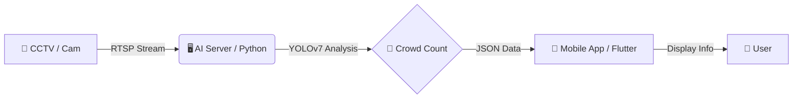

# 🍱 Cafeteria Crowd Monitor
### AI 기반 교내 식당 혼잡도 모니터링 시스템

> **"점심시간, 무작정 기다리지 마세요! CCTV와 AI가 실시간 혼잡도를 알려드립니다."**

  

---

## 📖 프로젝트 개요 (Overview)
**교내 식당 혼잡도 알리미**는 매일 반복되는 점심시간 대기 줄 문제를 해결하기 위해 개발된 **AI IoT 솔루션**입니다. 식당 내 CCTV 영상을 실시간으로 분석하여 대기 인원을 파악하고, 모바일 앱을 통해 학생들에게 예상 대기 시간과 혼잡도 정보를 제공합니다.

| 항목 | 내용 |
| :--- | :--- |
| **개발 기간** | 2025.03 ~ 2025.06 (약 3개월) |
| **개발 인원** | **1인 개발 (Full Stack & AI)** |
| **담당 역할** | 기획, 시스템 설계, AI 모델 학습, 서버 구축, 앱 개발 전 과정 |
| **주요 기술** | Python (YOLOv7), Flask, Flutter |

### 🛠️ 기획 배경
* **문제점:** 점심시간마다 긴 대기 줄로 인해 학생들이 식사를 포기하거나 수업에 늦는 경우가 빈번하게 발생했습니다.
* **해결책:** "식당에 가기 전에 미리 상황을 알 수 있다면?"이라는 아이디어에서 출발하여, **객체 탐지 AI**를 활용해 대기 인원과 예상 시간을 실시간으로 알려주는 시스템을 구축했습니다.

---

## 📂 저장소 구조 (Repository Structure)
이 프로젝트는 기능별로 모듈화되어 두 개의 폴더(저장소)로 구성되어 있습니다.

| 구분 | 폴더명 | 설명 | 기술 스택 |
| :---: | :--- | :--- | :--- |
| **📱 App** | `cafeteria_monitor_app` | 사용자용 모바일 앱 (UI/UX) | Flutter, Dart |
| **🖥️ Server** | `CafeteriaCrowdMonitor` | AI 영상 분석 및 API 서버 | Python, YOLOv7, Flask |

---

## 📐 시스템 아키텍처 (Architecture)

1. 영상 수집: 식당 내 카메라에서 영상을 프레임 단위로 캡처합니다.

2. 객체 탐지: AI 서버(CafeteriaCrowdMonitor)에서 YOLOv7 모델이 사람(Person) 객체를 실시간으로 인식합니다.

3. 데이터 가공: 탐지된 인원수를 기반으로 혼잡도 레벨(여유/보통/혼잡)을 산출하여 API로 송출합니다.

4. 정보 제공: 모바일 앱(cafeteria_monitor_app)에서 API를 호출하여 사용자에게 시각적인 정보를 제공합니다.

---

### 👇 **[Part 2] 주요 기능 ~ 하단 끝까지**
*(위 코드 바로 아래에 이어서 붙여넣으세요)*

---

## 🚀 주요 기능 (Key Features)

### 1. 📸 실시간 인원 카운팅 (AI Server)
* 식당 내 CCTV(또는 웹캠) 영상을 스트리밍하여 분석합니다.
* **YOLOv7** 객체 탐지 모델을 활용하여 화면 내의 사람(Person) 객체를 정확하게 카운팅합니다.
* 중복 탐지를 방지하고 정확도를 높이기 위한 알고리즘이 적용되었습니다.

### 2. 🚦 혼잡도 시각화 (Mobile App)
* 분석된 인원수를 바탕으로 혼잡도를 **3단계(여유, 보통, 혼잡)**로 구분하여 표시합니다.
* 직관적인 **신호등 색상(초록, 노랑, 빨강)** UI를 적용하여 현재 상태를 한눈에 파악할 수 있습니다.

### 3. ⏳ 대기 시간 예측
* 현재 대기 인원수와 테이블 회전율 데이터를 기반으로 **'입장까지 남은 예상 시간'**을 계산합니다.
* 사용자 설문조사(30명 대상) 요구사항을 반영하여 개발되었습니다.

---

## 👨‍💻 핵심 문제 해결 (Problem Solving)

### 1. 객체 겹침(Occlusion)으로 인한 인식률 저하
> **문제:** 점심 피크타임에 줄을 서 있는 학생들이 겹쳐 보여, 한 사람으로 인식되거나 인식이 누락되어 정확도가 15% 이상 하락함.

* **✅ 해결:**
    1.  카메라 설치 **각도(Angle)와 높이**를 다양하게 테스트하여 겹침이 최소화되는 'High-Angle' 최적 위치를 선정했습니다.
    2.  YOLOv7의 **NMS(Non-Maximum Suppression)** 임계값을 튜닝하여 겹친 객체 분리 성능을 개선했습니다.
* **📈 성과:** 인원 측정 정확도 **95% 이상** 확보.

### 2. 실시간 영상 처리 지연 (Latency)
> **문제:** 고해상도 영상을 프레임마다 분석하느라 서버 부하가 심하고, 앱 업데이트가 지연되는 현상 발생.

* **✅ 해결:**
    1.  입력 영상 해상도를 분석에 지장이 없는 수준(**640x640**)으로 리사이징했습니다.
    2.  모든 프레임이 아닌 **초당 5프레임(5 FPS)**만 샘플링하여 분석하도록 로직을 경량화했습니다.
* **📈 성과:** 실시간성을 유지하면서 서버 리소스 사용량 **40% 절감**.

---

## 💻 기술 스택 (Tech Stack)

### AI & Backend (`CafeteriaCrowdMonitor`)
*  **Language**
*  **AI Model**
*  **Framework**
*  **Server**
*  **Library**

### Frontend (`cafeteria_monitor_app`)
*  **Framework**
*  **Language**
*  **State Mngt**
*  **Network**

---

## ⚙️ 실행 화면 (Preview)

### 1. 혼잡도 분석 (AI Server)
**CCTV 기반 YOLOv7 객체 탐지 및 혼잡도 분석 화면**

  

### 2. 앱 주요 화면 (Mobile App)

| 앱 메인 화면 | 상세 정보 화면 |
| :---: | :---: |
|  |  |
| **실시간 혼잡도 확인** | **예상 대기시간 안내** |

-----

## 📞 Contact
* **Email:** minseok.c02@gmail.com
* **GitHub:** [https://github.com/asdzxc000115](https://github.com/asdzxc000115)
